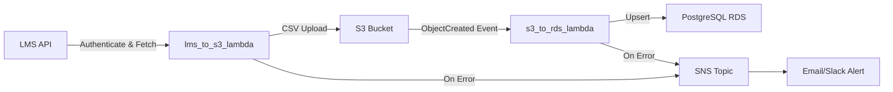

# 📦 LMS to S3 & RDS ETL

**Automated AWS ETL Pipeline for Learning Management System Data**

This repository implements two serverless AWS Lambda functions that extract, transform, and load (ETL) user data from a Learning Management System (LMS) into Amazon S3, then sync that data into a PostgreSQL RDS instance.

---
## 🏗️ Architecture Overview



---
## ⚙️ Components

### 1. `lms_to_s3_lambda.py`
- **Purpose**: Connects to the LMS API, retrieves user records for a specific department, processes and flattens JSON responses, renames and consolidates columns, then writes a CSV to S3.
- **Key Steps**:
  1. Authenticate via `/authenticate` endpoint.
  2. Call `GET /users` with department filter.
  3. Remove pagination metadata (`totalItems`, etc.).
  4. Normalize nested user objects into a flat DataFrame.
  5. Rename columns (e.g., `firstName` → `first_name`).
  6. Consolidate all `customFields.*` into a single JSON column.
  7. Upload CSV to `s3://$S3_BUCKET_NAME/$S3_DEPARTMENT_MEMBERS_PATH`.
  8. On failure, publish error message to SNS.

### 2. `s3_to_rds_lambda.py`
- **Purpose**: Triggered by new CSV in S3, loads it into a DataFrame, aligns column data types based on the target RDS schema, and performs an upsert into the `department_members` table.
- **Key Steps**:
  1. Read CSV from S3 when an `ObjectCreated:*` event fires.
  2. Inspect RDS table schema via SQLAlchemy inspector.
  3. Convert DataFrame column types (INT, VARCHAR, DATE/TIMESTAMP, JSON) to match the schema.
  4. Perform efficient upsert (`ON CONFLICT DO UPDATE`) keyed on `lms_user_id`.
  5. On failure, publish error message to SNS.

---
## 🛠️ Prerequisites & Setup

1. **AWS Resources**:
   - SNS Topic for error notifications.
   - S3 Bucket to store CSV exports.
   - PostgreSQL RDS instance with network access from Lambdas (same VPC or public).
2. **IAM Role** for each Lambda with the following policies:
   - `lms_to_s3_lambda`: `execute-api:Invoke`, `s3:PutObject`, `sns:Publish`
   - `s3_to_rds_lambda`: `s3:GetObject`, `rds-db:connect`, `sns:Publish`
3. **Environment Variables** (via Lambda console or `.env` locally):
   ```bash
   REST_API_URL=...
   LMS_USERNAME=...
   LMS_PASSWORD=...
   LMS_PRIVATE_KEY=...
   COURSE_ID=...
   DEPARTMENT_ID=...

   S3_BUCKET_NAME=...
   S3_DEPARTMENT_MEMBERS_PATH=...
   SNS_TOPIC_ARN=...

   BUSINESS_TRACKING_HOST=...
   BUSINESS_TRACKING_PORT=5432
   BUSINESS_TRACKING_DBNAME=...
   BUSINESS_TRACKING_USER=...
   BUSINESS_TRACKING_PASSWORD=...
   BUSINESS_TRACKING_SSLMODE=require
   BUSINESS_TRACKING_SCHEMA=public
   ```
4. **Dependencies**:
   ```bash
   pip install -r requirements.txt
   ```

---
## 🚀 Deployment

1. **Package & Deploy** Lambdas:
   ```bash
   zip -r lms_to_s3.zip src/lms_to_s3_lambda.py
   aws lambda create-function --function-name lms_to_s3_lambda ...
   zip -r s3_to_rds.zip src/s3_to_rds_lambda.py
   aws lambda create-function --function-name s3_to_rds_lambda ...
   ```
2. **Configure Triggers**:
   - **lms_to_s3_lambda**: CloudWatch Events rule (e.g., cron(0 2 * * ? *))
   - **s3_to_rds_lambda**: S3 bucket notification on `ObjectCreated:*`

---
## 🧪 Testing & Validation

- **Local Dry Run** (with `.env` loaded):
  ```bash
  python src/lms_to_s3_lambda.py
  python src/s3_to_rds_lambda.py
  ```
- **AWS Invoke**:
  ```bash
  aws lambda invoke --function-name lms_to_s3_lambda output.json
  aws lambda invoke --function-name s3_to_rds_lambda output.json
  ```
- **Verify** CSV in S3 and rows in RDS table.

---
## 📈 Monitoring

- **CloudWatch Logs**: View Lambda execution and errors.
- **CloudWatch Alarms**: Set alarms on Lambda error metrics.
- **SNS Notifications**: Subscribe email or Slack integration for instant failure alerts.

---
## 👨‍💻 Author

Hung (Clark) Huynh | [GitHub](https://github.com/huynhhoachung) | [LinkedIn](https://linkedin.com/in/hung-huynh-71808b1ba)
